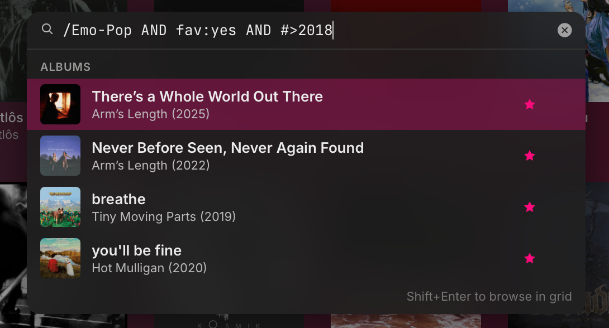
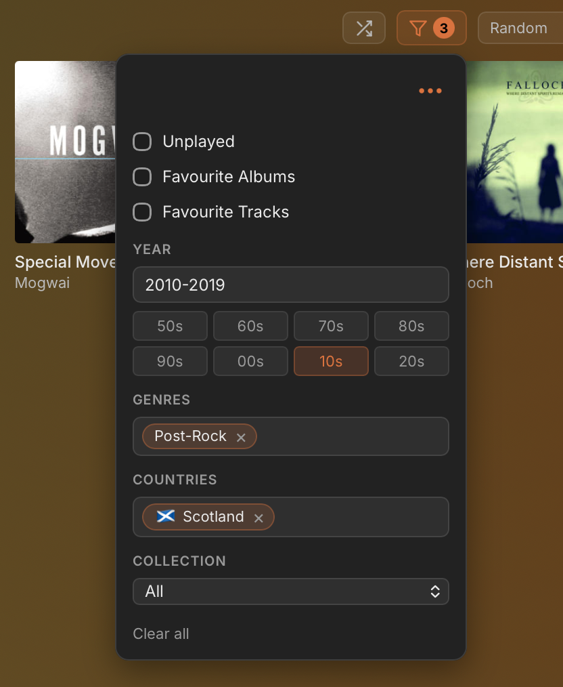

<div align="center">


<h1 align="center">ramus</h1>
<p align="center"><sub>ramus | ra·​mus | a projecting part, elongated process, or branch</sub></p>

[](https://github.com/1337raspberry/ramus/actions/workflows/ci.yml)
[](https://github.com/1337raspberry/ramus/actions/workflows/release.yml)
[](LICENSE)
[](https://github.com/1337raspberry/ramus/releases)
[](#download)

</div>

<p align="center">
  
</p>

---

## About

> ramus is a genre-first music client for Plex focused on discovering and exploring your existing library. Out of the box It's designed to function with the metadata plex has already assigned your albums to give you a rich hierarchical tree-like view of your library, while genre-obsessives can go as deep and custom as they wish and browse by their own dream musical taxonomy. 

## Features

- **Hierarchical browsing** - ramus features a tree-like genre browser that automatically matches your existing library. It comes with a custom and rich genre hierarchy by default, but you can build and supply your own, or maybe download a custom setup built by somebody else
- **Instant locally cached search** - Ctrl+F > "free b" > Enter and you're listening to Free Bird. Or just "wonrederwall" and it knows you meant Wonderwall. Also features search operators and shortcuts for power users eg "/Dream-Pop AND year:>2013"
- **Library filters** which can be saved as easy-reach bookmarks, and even cached for offline listening (with no file size limit). Save all your favourite albums in the dubstep genre as "workout tunes" and download the whole thing for your gym with the dodgy wifi.
- **Album-Art focused** - Browse by art grid instead of dry text lists, and enjoy auto-extracted background and accent colours making your entire music listening experience cohesive and _aesthetic_
- **Waveform Seeking** - If you have Sonic Analysis enabled on your server, you already have all this wonderful data. Skip past the 6 minute ambient intro straight to the visible  14 minutes of silence on that bonus track to the good stuff.
- **Track popularity data** - See the top tracks in an album based on crowdsourced popularity data supplied directly via plex and obtained via users starring their own libraries, or see a unique popularity chart over an albums track listing to get the full picture. 
- **A good ol fashioned visualiser and full screen oriented "focus mode"** - Watch your music bounce like it's 2003
- **Lyrics courtesy of lrclib** - No account needed and a huge number of the lyrics are synced too. All credits to lrclib. what a service!

## Screenshots

<table>
  <tr>
    <td></td>
    <td></td>
  </tr>
  <tr>
    <td></td>
    <td></td>
  </tr>
  <tr>
    <td></td>
    <td></td>
  </tr>
</table>

---

## Download

Pre-built installers are produced by [GitHub Actions](https://github.com/1337raspberry/ramus/actions/workflows/release.yml) and attached to each [Release](https://github.com/1337raspberry/ramus/releases).

| Platform                          | Artifact                                                                  | Notes                                                                                                 |
| --------------------------------- | ------------------------------------------------------------------------- | ----------------------------------------------------------------------------------------------------- |
| **macOS** (Apple Silicon + Intel) | `ramus_<version>_universal.dmg`                                           | Universal binary. libmpv + ffmpeg/codec stack bundled inside the `.app`.                              |
| **Windows 10/11 (x64)**           | `ramus_<version>_x64-setup.exe` (NSIS) or `ramus_<version>_x64_en-US.msi` | `libmpv-2.dll` ships next to the executable.                                                          |
| **Linux (x86_64)**                | `ramus_<version>_amd64.AppImage` / `.deb` / `.rpm`                        | The AppImage bundles libmpv. The `.deb` / `.rpm` depend on the system `libmpv2` / `mpv-libs` package. |
| **iOS**                           | Build from source only for now                                            | More on that below.                                                                                   |
| **Android**                       | `ramus_<version>_universal.apk`                                           | Signed multi-ABI APK (`arm64-v8a` + `armeabi-v7a`); sideload via `adb install` or your file manager.  |

> ⚠️ **Releases are currently unsigned or self-signed.** As with many open source projects, macOS gatekeeper will quarantine the `.app` and tell you it's damaged or untrusted; Windows SmartScreen will whine that it's unrecognised, and android Play Protect will ask to scan it first. The release notes include the standard `xattr -cr ramus.app` and SmartScreen "More info → Run anyway" solutions.

### Requirements

- **macOS** - the bundle is built around a theoretical minimum of **10.13 (High Sierra)**, but the only versions I've actually run it on are **macOS 15 (Sequoia)** and newer. Anything older may work, may not - no promises.
- **Windows** 10 (x64) or newer; WebView2 runtime (preinstalled on Windows 11; the installer pulls it in on Windows 10).
- **Linux** with WebKitGTK 4.1 (most current distributions). The `.deb` / `.rpm` need `libmpv2` (or `mpv-libs`) installed; the AppImage doesn't.
- **iOS** 17.5 or newer.
- **Android** 7.0 Nougat (API 24) or newer.
- A **Plex Media Server** you can sign into that has a music library.

---

## Build from source

You'll need:

- **Rust** stable (`rustup install stable`).
- **Node.js** 20+ and **npm**.
- **Tauri 2 prerequisites** for your platform — follow [tauri.app/start/prerequisites](https://tauri.app/start/prerequisites/).
- **CMake** (and ideally **Ninja**). The focus mode visualiser includes an Opus decoder via the `symphonia-adapter-libopus` crate, which compiles a vendored libopus C source through `cmake` at build time. Without it, `cargo build` will error out partway through `opusic-sys`.
  - macOS: `brew install cmake ninja`.
  - Linux (Debian/Ubuntu): `sudo apt-get install cmake ninja-build`.
  - Linux (Fedora): `sudo dnf install cmake ninja-build`.
  - Windows: install [CMake](https://cmake.org/download/) (or `winget install Kitware.CMake` / `choco install cmake`) and make sure it's on `PATH`. The MSVC build tools you already need for Tauri provide the rest of the C toolchain — Ninja is optional on Windows; CMake will fall back to MSBuild.
- **libmpv** in the dev loop:
  - macOS: `brew install mpv` (provides `libmpv.dylib`).
  - Linux (Debian/Ubuntu): `libmpv-dev libwebkit2gtk-4.1-dev libgtk-3-dev` (and `build-essential pkg-config` if you don't have them already).
  - Linux (Fedora): `mpv-devel webkit2gtk4.1-devel gtk3-devel`.
  - Windows: the build script downloads a prebuilt LGPL DLL; nothing to install manually.
- **For mobile**:
  - **iOS — building**: Xcode + `xcodegen` + `cocoapods`. That's enough for `cargo tauri ios build`.
  - **iOS — deploying to a tethered device** (`cargo tauri ios dev`): also `libimobiledevice` + `ios-deploy` (`brew install libimobiledevice ios-deploy`).
  - **Android**: Android Studio + the NDK installed via SDK Manager.

```sh
git clone https://github.com/1337raspberry/ramus
cd ramus

# Frontend deps
( cd ui && npm install )

# Run the desktop app (Rust + React hot-reload)
cargo tauri dev

# Build a release artifact for your current platform
cargo tauri build
```

Mobile:

```sh
# iOS
./scripts/regen-ios-project.sh
cargo tauri ios build
```

> You'll need to sideload this yourself. If demand is there I may put this on the App Store, but I'm not in a rush to pay Apple for the privilege of releasing an open-source, ad-free, zero cost app.

```sh
# Android — emulator or connected device
cargo tauri android dev

# Android - apk build to transfer to your device
cargo tauri android build
```

Pre-flight checks (CI runs the same):

```sh
cargo clippy --workspace --all-targets -- -D warnings
cargo test -p ramus-core
( cd ui && npx tsc --noEmit )
```

---

## Architecture

```
ramus-core/    Rust library — all business logic.
               Plex client, cache (rusqlite + FTS5), sync engine,
               search, genre tree, playback core.
ramus-tauri/   Tauri 2 app shell.
               IPC commands, libmpv FFI, media controls,
               iOS Swift bridge, Android Kotlin bridge.
ui/            React + Vite + Zustand + TypeScript.
plugins/       Tauri plugin: iOS Swift bridge (MPVKit) and
               Android Kotlin bridge (Media3 / ExoPlayer).
scripts/       Build helpers (libmpv bundling, codesigning,
               license regeneration).
```

### Tech stack

- **Backend** - [Rust](https://www.rust-lang.org/), [Tauri 2](https://tauri.app/), [rusqlite](https://github.com/rusqlite/rusqlite) with WAL + FTS5, [reqwest](https://github.com/seanmonstar/reqwest), [tokio](https://tokio.rs/).
- **Audio** - [libmpv](https://mpv.io/) (loaded dynamically via [libloading](https://github.com/nagisa/rust_libloading)) on desktop; [MPVKit](https://github.com/mpvkit/MPVKit) on iOS; [Media3 / ExoPlayer](https://developer.android.com/media/media3) on Android.
- **DSP** - [symphonia](https://github.com/pdeljanov/Symphonia) + [rustfft](https://github.com/ejmahler/RustFFT) for the focus mode visualiser on desktop. Opus playback (transcoded streams, downloaded `.ogg` copies) decodes via the [symphonia-adapter-libopus](https://github.com/sdroege/symphonia-adapter-libopus) crate, which bundles libopus C source and builds it via CMake.
- **System integration** - [souvlaki](https://github.com/Sinono3/souvlaki) for desktop media keys / Now Playing; `MPRemoteCommandCenter` on iOS; `MediaSession` + `MediaSessionService` on Android.
- **Frontend** - [React 19](https://react.dev/) + [Vite](https://vite.dev/) + [TypeScript](https://www.typescriptlang.org/), [Zustand](https://github.com/pmndrs/zustand) for state, [@tanstack/react-virtual](https://tanstack.com/virtual) for the long lists.
- **Fonts** - [Inter](https://rsms.me/inter/), [JetBrains Mono](https://www.jetbrains.com/lp/mono/), [Twemoji Country Flags](https://github.com/talkjs/country-flag-emoji-polyfill).

Most behaviour lives in `ramus-core` and is unit-tested. The Tauri layer is intentionally thin - IPC plumbing on top of the core, plus the platform-specific glue (FFI on desktop, Swift/Kotlin bridges on mobile).

---

## Privacy & Security

- **Plex auth tokens** are encrypted at rest with **AES-256-GCM**, using a key derived (`SHA-256`) from a stable per-machine identifier:
  
  - **macOS** — `IOPlatformUUID` (read via IOKit).
  - **Windows** — `HKLM\SOFTWARE\Microsoft\Cryptography\MachineGuid`.
  - **Linux** — `/etc/machine-id`.
  - **Android** — a random UUID generated on first run and stored in the app's sandboxed config dir.
  - **iOS** is the exception: tokens go directly into the system Keychain (no file, no AES layer), via a Swift `KeychainBridge`.
  
  The encrypted blob (`tokens.enc`) lives in the platform's standard app-data directory and is written atomically (tmp + `fsync` + `rename`) with `0o600` permissions on Unix. The threat defense model is "render the file inert if arbitrarily exfiltrated to another machine" - not protection against a local attacker who already has root on the same device. This is the same model (or in some cases, being encrypted is one step better) that most plex clients or even the official plex clients, operate on. 

- **No telemetry, no analytics, no crash reporters, no auto-updaters. Not ever.** ramus only talks to your Plex Media Server and plex.tv (for OAuth + server discovery). No other connections anywhere.

- **Server auth tokens are kept out of logs and UI.** Plex authenticates by query string (`?X-Plex-Token=…`), and reqwest's error formatter includes the failing URL. ramus redacts both: track URLs are never logged in full (only `ratingKey` / part-key), and `prefetch.rs::redact_reqwest_err()` peels the underlying error so download failures don't leak the token in logs. The mobile debug panel (long-press the EQ button) masks `X-Plex-Token=` and `X-Plex-Headers=` before rendering anything.

- **Local databases** (cache, image cache, audio cache, downloads) live in your platform's standard app-data directory :
  
  - macOS: `~/Library/Application Support/com.raspsoft.ramus/` (desktop). On iOS, everything lives inside the app's sandboxed container.
  - Windows: `%APPDATA%\raspsoft\ramus\`.
  - Linux: `~/.local/share/ramus/` (XDG-respecting `$XDG_DATA_HOME`).
  - Android: app-private storage. `network_security_config.xml` is setup to permit cleartext HTTP (against android defaults) for LAN addresses only (so you can reach `http://192.168.x.x:32400` on your home LAN.)


---

## Contributing

Bug reports, feature requests, and PRs are welcome. Read [CONTRIBUTING.md](CONTRIBUTING.md) before sending a non-trivial PR - it covers the project layout, the pre-push checks, and a few of the load-bearing constraints around playback timing and the mobile bridges.

This project follows the [Contributor Covenant 2.1](https://www.contributor-covenant.org/version/2/1/code_of_conduct/).

## Security Reporting

If you've found a vulnerability, please **don't open a public issue**. See [SECURITY.md](SECURITY.md) for the disclosure process and scope. In short: report through [GitHub Security Advisories](https://github.com/1337raspberry/ramus/security/advisories/new).

---

## Limitations, Known Issues & Planned Improvements

- The focus mode visualiser does not run/intercept our audio data "live", we need to compute the spectrum data separately. This leads to a negigible but not non-nothing cpu hit. This is a limitation of our broad one-size-fits-all mpv based audio engine (besides android). Hooking into the audio stream to do it live would require an entirely new audio engine I am pretty sure. For a feature that's off by default and I imagine most people will ignore, this is an okay compromise for now. 

- Because Plex only exposes minimal genre and style data on a standard broad api call, we need to maintain a local db with an initial cache/sync setup phase and deep sync on all albums. Without this we'd lack the data to make the app do the cool stuff it was built to do! This gives us the ability to do our super fast locally cached search as well which is great, and even on massive libraries, connected remotely, the initial sync is only a few minutes. Worth the trade off I think. Incremental syncs after that are genuinely incremental and if nothing changes in your library, are essentially a no-op. If plex ever changes what they serve out by default, we can reconsider this. 

- No playlist support - currently on the fence about if i even want to add this. Depends on demand i suppose.

- I wouldn't mind improving some of the more hidden/unintuitive ux. I've spent a lot of time making it as obvious and, what i think is as user friendly as possible. But this is still very much a myopic one person project. What is obvious to me might not be obvious to everybody else.

- The colour extraction and accent colours still aren't as perfect as I'd like, and there are some edge cases where things aren't as readable as I'd want, but I've done loads of tweaking to try and get to a happy medium, on many different displays, SDR and HDR too. So I might just have to accept that perfect is the enemy of good, or whatever it is they say.

- I wouldn't mind implementing the new JWT short lived token auth system that plex has recently rolled out, but as far as I can tell it only applies to plex.tv auth, not PMS server auth, so that token is always going to be perma and long standing. Mixing the two isn't ideal, so when that is fully baked into PMS, i would like to roll that out. No harm in extra hardening. 

---

## Trademarks & affiliation

ramus is an **independent third-party client**. It is not affiliated with, endorsed by, or sponsored by Plex or any of the upstream projects it builds on.

---

## Custom Hierarchy Tool

- details of how this works goes here. also i gotta setup an import feature on that too so people can import then customise then export again as .txt for sharing etc.

---

## License

ramus is licensed under the [MIT License](LICENSE).

### Third-party software

ramus links — at runtime, dynamically — against **libmpv** ([LGPL-2.1-or-later](https://www.gnu.org/licenses/old-licenses/lgpl-2.1.html)) on desktop. libmpv source is available at [github.com/mpv-player/mpv](https://github.com/mpv-player/mpv); a copy is shipped under `licenses/` in every release artifact. You may substitute your own libmpv build by placing it on the dynamic library search path — the search paths are documented in [`ramus-tauri/src/mpv_ffi.rs`](ramus-tauri/src/mpv_ffi.rs).

A handful of bundled Rust crates (notably the [symphonia](https://github.com/pdeljanov/Symphonia) audio decoder family) are distributed under [MPL-2.0](https://www.mozilla.org/en-US/MPL/2.0/). MPL-2.0 is file-scope copyleft and does not affect the rest of ramus.

The bundled music genre tree (`ramus-tauri/data/open.json`) is derived from the [beets](https://github.com/beetbox/beets) project's `genres-tree.yaml` (MIT, © Adrian Sampson) and has been substantially extended. See [NOTICE.md](NOTICE.md).

The full list of third-party Rust crates and npm packages — together with their license texts — is in [THIRD_PARTY_LICENSES.md](THIRD_PARTY_LICENSES.md), regenerated from `Cargo.lock` and `ui/package-lock.json` by [`scripts/generate-third-party-licenses.py`](scripts/generate-third-party-licenses.py).

## Acknowledgements

ramus is proudly built on the open source wonders that are:

- [mpv](https://mpv.io/) and the libmpv contributors.
- [Tauri](https://tauri.app/) - web frontend with minimal bloat, glorious
- [Plex](https://www.plex.tv/) - for the media server that makes this app possible.
- [beets](https://github.com/beetbox/beets) - for seeding the genre hierarchy (and helping me tag my music every day!)
- The [symphonia](https://github.com/pdeljanov/Symphonia), [rustfft](https://github.com/ejmahler/RustFFT), [souvlaki](https://github.com/Sinono3/souvlaki), and [rusqlite](https://github.com/rusqlite/rusqlite) maintainers - and everyone else listed in [THIRD_PARTY_LICENSES.md](THIRD_PARTY_LICENSES.md).
